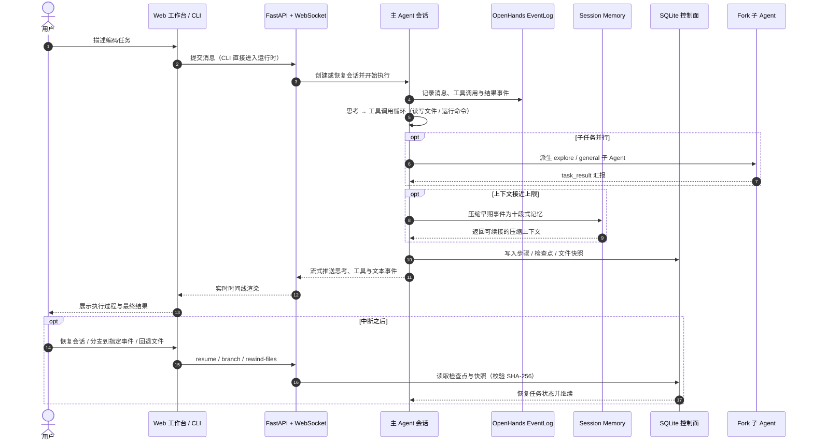

<div align="center">
  <h2>TaskMind · 本地 AI Agent Harness</h2>

  <p>
    <a href="https://github.com/Tassel9/TaskMind/stargazers"></a>
    
    
    
    
    
    
    
  </p>

  <p>面向长期工作的<strong>本地 AI Agent Harness</strong>。</p>
  <p>它不只完成当前对话，还会管理长上下文、跟踪复杂任务、恢复中断 Run、使用本地与 MCP 工具，并从真实完成的工作中逐步形成可复用的记忆与 Skill。</p>
  <p><sub>基于 Session Memory、Checkpoint 与 Fork 子 Agent，任务可恢复、可续接 —— 减少上下文丢失、重复执行与协作冲突。</sub></p>
</div>

## 项目预览

**新建任务**


描述一项编码任务，也可以直接粘贴代码或报错信息。任务以工作区为根目录执行，危险操作先请求确认，也可以切换为完全自主执行。

**编码任务对话**


执行过程以实时时间线呈现：思考、工具调用与结果一屏可见，回答支持 Markdown 与表格渲染；每个步骤都写入本地记录，可随时停止、分支或回退。

**技能体系**


把反复使用的编码流程沉淀成 SKILL.md 技能（调试 / 测试 / 重构 / Git / 审查 / 探索），模型按场景自动调用，也可以手动唤起。

## 核心功能

长期工作天然是**多轮、易中断、需要回头**的场景。TaskMind 围绕这一背景提供四项核心能力。

### ⏯️ Run 恢复与上下文压缩

> Run 进度持续跟踪，中断后可从断点继续；历史按 Token 预算动态压缩，窗口不膨胀、成本不失控。

- **Run-Task-Checkpoint 分层机制** — Run 承载单次执行、Task 跟踪跨 Run 的整体进度、Checkpoint 按执行边界落库状态与结果，实现跨 Run 的进度跟踪与断点恢复。
- **断点恢复** — 中断或崩溃后可从断点继续执行，已完成的步骤不会重复执行；结果不确定的调用先核验再继续，绝不盲目重放。
- **动态 Token Budget 与分层压缩** — 接近上下文上限时先整理工具输出，再把早期历史滚动摘要为结构化摘要，在保留任务目标和关键状态的前提下控制历史增长。
- **缓存命中率 68.0% → 75.5%** — 迭代回归中的平均缓存命中率由 68.0% 提升至 75.5%，减少每轮重复携带历史的 Token 开销。

### 🧠 分层长期记忆

> 少量核心记忆常驻上下文，其余记忆按需召回 —— 全量记忆不必挤进每次请求。

- **Core Memory** — 用户偏好、长期约束等核心信息常驻上下文。
- **Ordinary Memory** — 其余记忆跨会话保存；每个 Run 自动召回一次，经全文检索与向量检索双路互补、融合排序后仅注入 Top-5 摘要，需要完整内容时再由模型主动读取正文。
- **Post-Run Reflection** — 每次 Run 结束后自动反思，提取、更新和归档记忆，让记忆随真实工作持续生长。
- **Revision 校验与容量维护** — 记忆按修订版本管理并做校验，配合容量维护与归档机制，避免记忆被错误覆盖、无限膨胀。

### 🛠️ 基于会话记录的 Skill 学习

> 任务做完不是终点：从已完成会话中提炼可复用经验，让同类任务不必反复摸索。

- **候选技能提炼** — 从已完成任务的会话记录中挖掘可复用的操作模式，生成候选技能。
- **人工确认后才发布** — 候选技能必须先通过人工确认，绝不自动发布。
- **12 个模拟任务场景** — Skill 学习链路的通过率达到 92%。

### 🧪 Eval Harness 评测体系

> 用运行事实而不是主观感觉判断 Agent 的真实能力。

- **运行事实断言** — 对每次运行校验可验证的事实：工具是否按预期调用、任务是否真正完成，而不是只看模型怎么回答。
- **Trace 与重复测试** — 结合 Trace 轨迹与同一场景的重复运行，暴露偶发、不稳定的行为，定位 Bad Case。
- **Live 评测规模** — 在 DeepSeek V4 Flash 上完成 68 个能力单元、共 204 个 Live 样本：样本通过率 94.1%，单元三次稳定通过率 83.8%。

## 系统流程



## 技术栈

| 层次 | 技术 | 用途 |
| :--- | :--- | :--- |
| Agent 运行时 | OpenHands SDK 1.47、Event Sourcing | 事件日志、工具调用循环、上下文压缩 |
| 状态与恢复 | SQLite（WAL） | 会话 / 运行 / 步骤 / 检查点 / 文件快照 |
| Web 服务 | FastAPI、WebSocket、零构建前端 | 实时事件中继、会话控制台 |
| 双入口 | CLI REPL + Web | 同一份运行时状态，两端可接力 |
| 扩展 | MCP、SKILL.md | 外部工具接入、工作流沉淀 |
| 部署 | Docker | 容器化运行 |

## 本地运行

### 环境要求

| 组件 | 要求 | 说明 |
| :--- | :--- | :--- |
| Python | 3.12+ | 推荐 3.13 |
| 模型 API | DeepSeek（或任意 OpenAI / Anthropic 兼容端点） | 在 `.env` 中配置 |
| 网络 | 可访问模型 API | 其余全程本地 |

### 1. 安装与配置

```powershell
python -m venv .venv
.\.venv\Scripts\Activate.ps1
pip install -r requirements.txt
Copy-Item .env.example .env
```

编辑 `.env`（DeepSeek 官方 API 为例）：

```ini
APIKEY=sk-你的密钥
API=https://api.deepseek.com
MODEL=deepseek-v4-pro
```

也支持 Anthropic 兼容（`ANTHROPIC_API_KEY` / `ANTHROPIC_BASE_URL`）与 OpenAI 兼容（`OPENAI_API_KEY` / `OPENAI_BASE_URL`）两种配置方式。

### 2. 启动 Web 工作台

```powershell
python -m taskmind.server --port 8017
```

浏览器打开 `http://127.0.0.1:8017`，即可在本地控制台里发起编码任务。`--model` / `--api-base` 可临时覆盖 `.env`；直接双击 `web/index.html`（无后端）会自动降级为演示数据，仅作界面预览。

### 3. 或使用 CLI

```powershell
python -m taskmind.main                                                # 交互式 REPL
python -m taskmind.main --resume <SESSION_ID>                          # 恢复原会话
python -m taskmind.main --resume <ID> --fork-session                   # 恢复并分支，原会话不变
python -m taskmind.main --resume <ID> --rewind-files <CHECKPOINT_ID>   # 独立回退文件
```

REPL 内支持 `/context`、`/compact`、`/branch [EVENT_ID]`、`/tasks`、`/rewind-files`、`/runs`、`/steps`、`/uncertain`。

## 技能（SKILL.md）

技能按目录扫描，用户级优先于项目级：

```text
.taskmind/skills/<name>/SKILL.md     # 项目级：随仓库走
~/.taskmind/skills/<name>/SKILL.md   # 用户级：全局可用
```

frontmatter 示例：

```markdown
---
name: systematic-debugging
description: 系统化调试：复现 → 定位 → 根因 → 修复 → 验证
when_to_use: 当用户报告 bug、异常、行为不符预期时使用
user-invocable: true
---

# 系统化调试
...（正文 = 技能被调用时注入的提示词）
```

`user-invocable: true` 的技能可用 `/<name>` 手动唤起；其余由模型按 `when_to_use` 自动调用。技能改动后重启服务生效。

## 目录结构

```text
TaskMind
├── taskmind/                # Agent 运行时与 Web 服务
│   ├── agent.py             # Agent 外壳与事件处理
│   ├── runtime_store.py     # SQLite 控制面（会话 / 运行 / 步骤 / 检查点）
│   ├── session_memory.py    # 十段式会话记忆
│   ├── skills.py            # SKILL.md 技能发现与执行
│   ├── tools.py             # 内建工具集
│   ├── server.py            # FastAPI + WebSocket 服务
│   └── main.py              # CLI 入口
├── web/                     # 零构建 Web 工作台
├── .taskmind/skills/        # 项目级技能（调试 / 测试 / 重构 / Git ...）
├── docs/images/             # README 截图
├── requirements.txt
└── Dockerfile
```

## 说明与边界

- **本地优先** — 会话、运行、检查点全部存放于本机 SQLite（`~/.taskmind/runtime.db`），除模型调用外不出网。
- **危险操作默认确认** — Shell、删除类操作会先请求人工确认；权限模式可随时调整。
- **恢复不猜测** — 结果不确定的写入必须核验后才继续；文件回退先做 SHA 校验，拒绝覆盖外部漂移。
