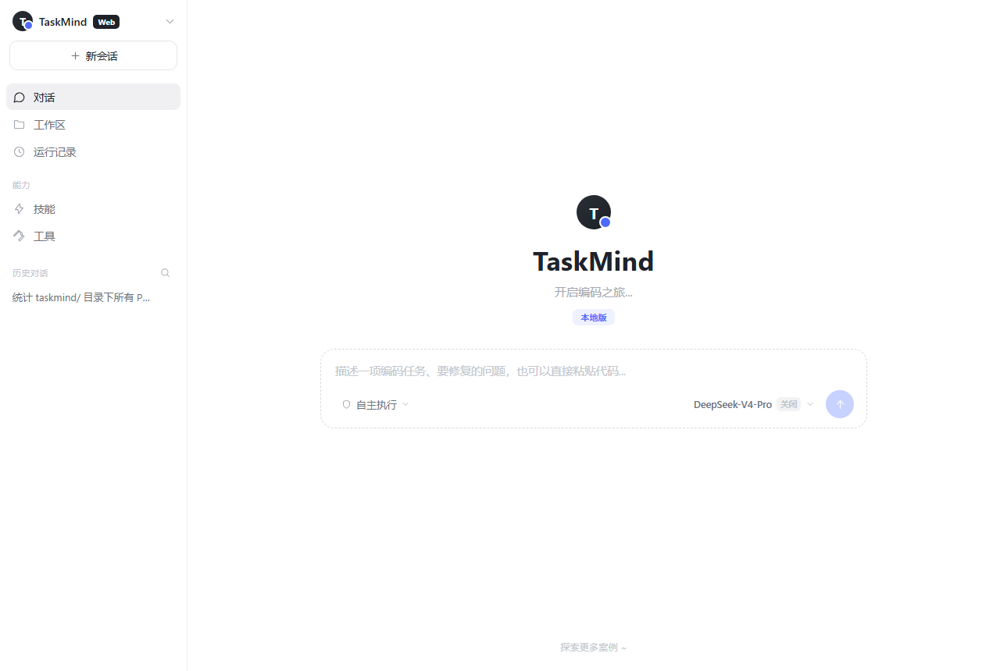
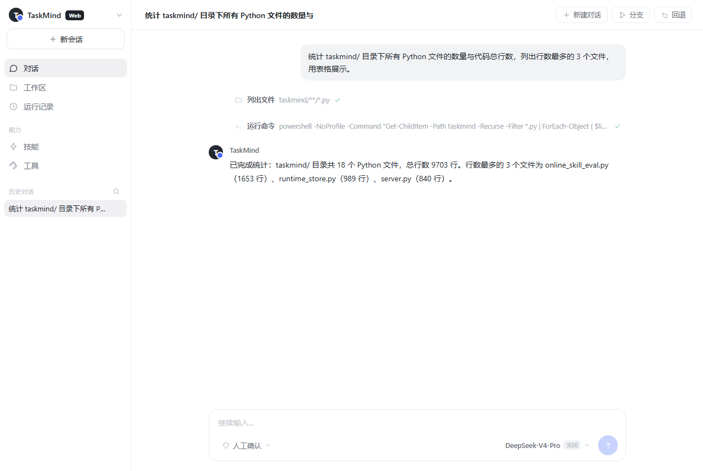
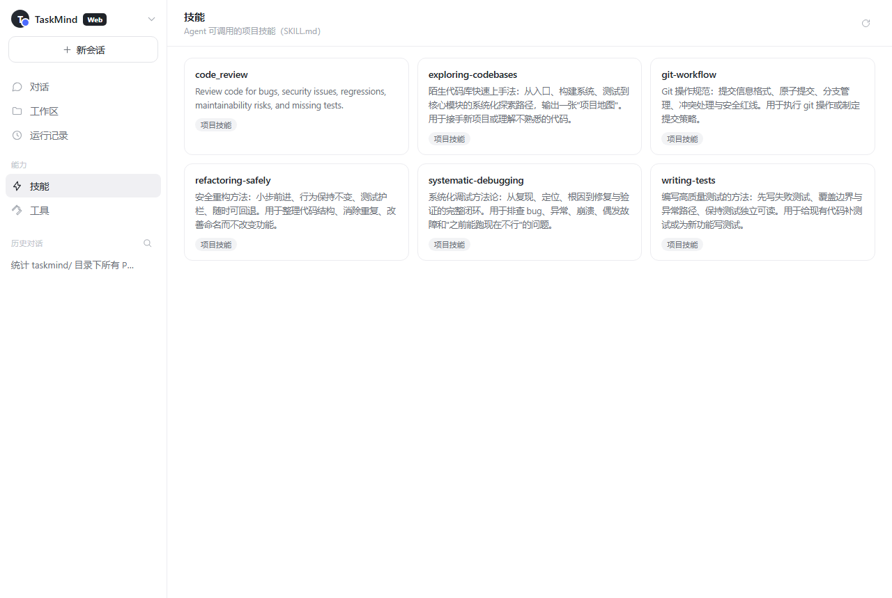
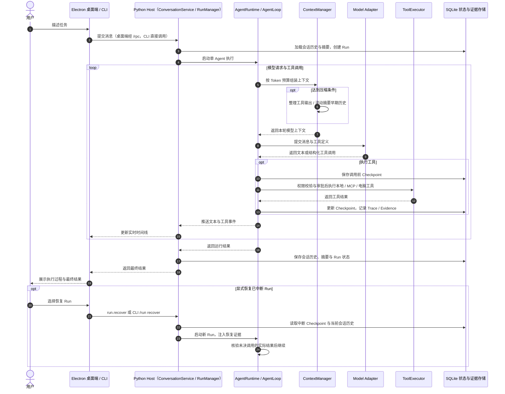

<div align="center">
  <h2>TaskMind · 本地 AI Agent Harness</h2>

  <p>
    <a href="https://github.com/Tassel9/TaskMind/stargazers"></a>
    
    
    
    
    
    
    
  </p>

  <p>面向长期工作的<strong>本地 AI Agent Harness</strong>。</p>
  <p>它不只完成当前对话，还会管理长上下文、跟踪复杂任务、恢复中断 Run、使用本地与 MCP 工具，并从真实完成的工作中逐步形成可复用的记忆与 Skill。</p>
  <p><sub>基于上下文压缩、长期记忆与 Checkpoint，单 Agent 任务可恢复、可续接，保留任务状态与执行证据。</sub></p>
</div>

## 项目预览

**新建任务**



描述一项编码任务，也可以直接粘贴代码或报错信息。任务以工作区为根目录执行，危险操作先请求确认，也可以切换为完全自主执行。

**编码任务对话**



执行过程以实时时间线呈现：回答、工具调用与结果一屏可见，回答支持 Markdown 与表格渲染；运行过程写入本地记录，可中断 Run，并基于 Checkpoint 恢复执行。

**技能体系**



把反复使用的编码流程沉淀成 SKILL.md 技能（调试 / 测试 / 重构 / Git / 审查 / 探索），模型按场景自动调用，也可以手动唤起。

## 核心功能

长期工作天然是**多轮、易中断、需要回头**的场景。TaskMind 围绕这一背景提供四项核心能力。

### ⏯️ Run 恢复与上下文压缩

> Run 进度持续跟踪，中断后可从断点继续；历史按 Token 预算动态压缩，窗口不膨胀、成本不失控。

- **Run-Task-Checkpoint 分层机制** — Run 承载单次执行、Task 跟踪跨 Run 的整体进度、Checkpoint 按执行边界落库状态与结果，实现跨 Run 的进度跟踪与断点恢复。
- **断点恢复** — 中断后显式恢复 Run，检查点提供已完成步骤与未决工具调用的证据；恢复上下文要求先核验结果不确定的调用，再决定是否重试。
- **动态 Token Budget 与分层压缩** — 接近上下文上限时先整理工具输出，再把早期历史滚动摘要为结构化摘要，在保留任务目标和关键状态的前提下控制历史增长。
- **缓存命中率 68.0% → 75.5%** — 迭代回归中的平均缓存命中率由 68.0% 提升至 75.5%，减少每轮重复携带历史的 Token 开销。

### 🧠 分层长期记忆

> 少量核心记忆常驻上下文，其余记忆按需召回 —— 全量记忆不必挤进每次请求。

- **Core Memory** — 用户偏好、长期约束等核心信息常驻上下文。
- **Ordinary Memory** — 其余记忆跨会话保存；每个 Run 自动召回一次，经全文检索与向量检索双路互补、融合排序后仅注入 Top-5 摘要，需要完整内容时再由模型主动读取正文。
- **Post-Run Reflection** — 每次 Run 结束后自动反思，提取、更新和归档记忆，让记忆随真实工作持续生长。
- **Revision 校验与容量维护** — 记忆按修订版本管理并做校验，配合容量维护与归档机制，避免记忆被错误覆盖、无限膨胀。
- **记忆信任边界** — Core、INDEX 和自动召回片段作为历史背景数据传入，只有固定 Memory Policy 使用系统角色；记忆不能代替当前用户授权。写入规则区分真实要求与引用、假设，不把绕过审批等越权指令作为长期要求。这是降低提示注入风险的措施，不是绝对防护；原话匹配仍只校验来源，工具权限机制保持不变。

在 `backend` 目录运行 `python -m tests.eval_legacy.memory.run_injection_smoke` 可做小规模真实模型回归（需要已配置的模型服务）。评测使用临时记忆和无副作用的模拟删除工具，不操作真实工作区；样本通过不代表所有提示注入都会被阻止。

### 🛠️ 基于会话记录的 Skill 学习

> 任务做完不是终点：从已完成会话中提炼可复用经验，让同类任务不必反复摸索。

- **候选技能提炼** — 从已完成任务的会话记录中挖掘可复用的操作模式，生成候选技能。
- **人工确认后才发布** — 候选技能必须先通过人工确认，绝不自动发布。
- **12 个模拟任务场景** — Skill 学习链路的通过率达到 92%。

### 🧪 Eval Harness 评测体系

> 用运行事实而不是主观感觉判断 Agent 的真实能力。

- **运行事实断言** — 对每次运行校验可验证的事实：工具是否按预期调用、任务是否真正完成，而不是只看模型怎么回答。
- **Trace 与重复测试** — 结合 Trace 轨迹与同一场景的重复运行，暴露偶发、不稳定的行为，定位 Bad Case。
- **Live 评测规模** — 在 DeepSeek V4 Flash 上完成 68 个能力单元、共 204 个 Live 样本：样本通过率 94.1%，单元三次稳定通过率 83.8%。

## 系统流程

当前主执行链是**单 Agent 的模型与工具循环**，由项目自身的 `AgentRuntime / AgentLoop` 实现。上下文摘要、记忆反思与 Skill 提炼使用独立模型调用；当前没有子 Agent 的 fork、调度与结果汇总机制。



## 技术栈

| 层次 | 技术 | 用途 |
| :--- | :--- | :--- |
| Agent 运行时 | 自定义 AgentRuntime / AgentLoop、模型适配器 | 单 Agent 模型与工具循环、上下文压缩 |
| 状态与恢复 | SQLite（WAL） | 会话 / Task / Run / Checkpoint / Trace / Evidence |
| 本地服务 | FastAPI、WebSocket JSON-RPC | Python Host、`/rpc` 接口、实时事件中继 |
| 双入口 | Electron + React + TypeScript 桌面端、CLI REPL | 共用 ConversationService 与 RunManager |
| 扩展 | MCP、SKILL.md、Windows Computer Helper | 外部工具接入、技能加载、电脑操作 |

## 本地运行

当前桌面端和电脑操作面向 Windows，使用 Electron + React 界面和 Python Host。
模型密钥可通过设置页保存到 Windows 凭据管理器，也可使用后端环境配置。

### 环境要求

| 组件 | 要求 | 说明 |
| :--- | :--- | :--- |
| 操作系统 | Windows | 电脑操作使用 UI Automation、SendInput 和 PrintWindow |
| Python | 3.12+ | 推荐 3.13 |
| 模型 API | DeepSeek（或任意 OpenAI / Anthropic 兼容端点） | 在 `.env` 中配置 |
| 网络 | 可访问模型 API | 其余全程本地 |

### 1. 安装与配置

```powershell
cd backend
python -m venv .venv
.\.venv\Scripts\Activate.ps1
pip install -r requirements.txt
Copy-Item .env.example .env
```

编辑 `.env`（DeepSeek 官方 API 为例）：

```ini
DEEPSEEK_API_KEY=你的密钥
DEEPSEEK_BASE_URL=https://api.deepseek.com
DEEPSEEK_MODEL=deepseek-v4-pro
MODEL_DEFAULT_PROVIDER=deepseek
```

也支持 Anthropic 兼容（`ANTHROPIC_API_KEY` / `ANTHROPIC_BASE_URL`）与 OpenAI 兼容（`OPENAI_API_KEY` / `OPENAI_BASE_URL`）两种配置方式。

### 2. 启动后端和桌面端

```powershell
python -m app.server --port 8000
```

在另一个 PowerShell 终端进入项目根目录，再启动桌面端：

```powershell
cd desktop
npm ci
npm run electron:dev
```

桌面端通过 `http://127.0.0.1:8000` 对应的 JSON-RPC WebSocket 连接后端。
后端启动时可使用 `--provider` / `--model` 临时覆盖模型选择。

### 3. 或使用 CLI

```powershell
python -m app           # 在 backend 目录启动交互式 CLI
python -m app --help    # 查看当前 CLI 参数
```

REPL 内支持 `/new`、`/sessions`、`/runs`、`/run <Run ID>`、`/run recover <Run ID>`、`/checkpoints`、`/trace <Run ID>`；输入 `/help` 查看全部命令。

## 技能（SKILL.md）

技能按目录扫描，用户级优先于项目级：

```text
backend/.taskmind/skills/<name>/SKILL.md # 项目级技能
~/.taskmind/skills/<name>/SKILL.md   # 用户级：全局可用
```

frontmatter 示例：

```markdown
---
name: systematic-debugging
description: 系统化调试：复现 → 定位 → 根因 → 修复 → 验证
when_to_use: 当用户报告 bug、异常、行为不符预期时使用
user-invocable: true
---

# 系统化调试
...（正文 = 技能被调用时注入的提示词）
```

`user-invocable: true` 的技能可用 `/<name>` 手动唤起；其余由模型按 `when_to_use` 自动调用。技能改动后重启服务生效。

## 目录结构

```text
TaskMind
├── backend/
│   ├── app/                 # Agent、会话、上下文、记忆、任务和工具
│   │   ├── computer/        # Windows 电脑操作运行时和 Python helper
│   │   ├── model_settings/  # 模型配置与 Windows 凭据管理器
│   │   └── server/          # FastAPI + JSON-RPC WebSocket Host
│   ├── tests/               # 离线回归和冻结 Eval V1
│   ├── scripts/             # 开发演示与诊断脚本
│   └── .taskmind/           # 本地运行数据，Git 忽略
├── desktop/
│   ├── electron/            # 桌面窗口、审批浮窗和系统通知
│   └── src/                 # React 界面与 RPC 客户端
├── docs/                    # 文档和演示资源
└── workspace/               # 默认任务工作区
```

## 说明与边界

- **本地优先** — 会话、运行、检查点存放于 `backend/.taskmind/taskmind.db`；模型调用和显式联网工具会访问外部服务。
- **进程隔离边界** — 当前没有原生 OS 隔离后端；请求隔离的 Shell / MCP 调用会拒绝执行。只有显式配置可信的 `host` 模式才直接运行，详见 [执行边界](docs/sandbox.md)。
- **危险操作默认确认** — Shell、删除类操作会先请求人工确认；权限模式可随时调整。
- **恢复证据与副作用边界** — Checkpoint 记录已完成与未决调用，恢复上下文要求先核验未决调用；这不保证跨外部系统的副作用恰好执行一次。
